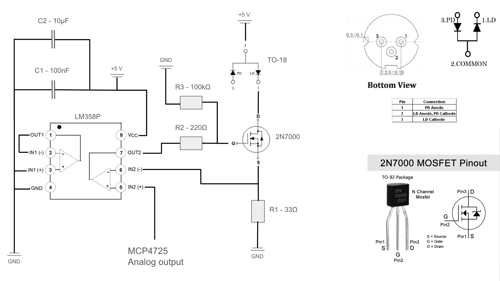
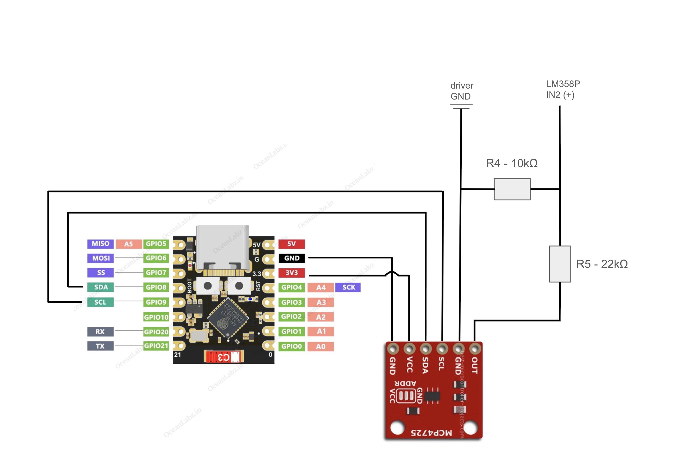

# ESP32-C3 Laser Constant Current Controller

A laser current controller based on an ESP32-C3 Super Mini, MCP4725 DAC, and an external constant current driver. The ESP32 sets a digital value from 0 to 1, the MCP4725 converts it to an analog voltage, and the current driver converts that voltage into a corresponding laser current in milliamps.

## NO PWM
Unlike PWM control, this method does not regulate laser brightness by rapidly switching the laser on and off. Instead, it changes the actual continuous current flowing through the laser diode, allowing smooth analog intensity control.

## Constant Current Driver

This part of the circuit controls the laser diode current using the LM358P, 2N7000 MOSFET, and supporting components.

## ESP32-C3 and MCP4725 DAC

The ESP32-C3 Super Mini communicates with the MCP4725 over I2C. Since the ESP32-C3 does not have a built-in DAC, the MCP4725 generates the analog control voltage required by the constant current driver.

